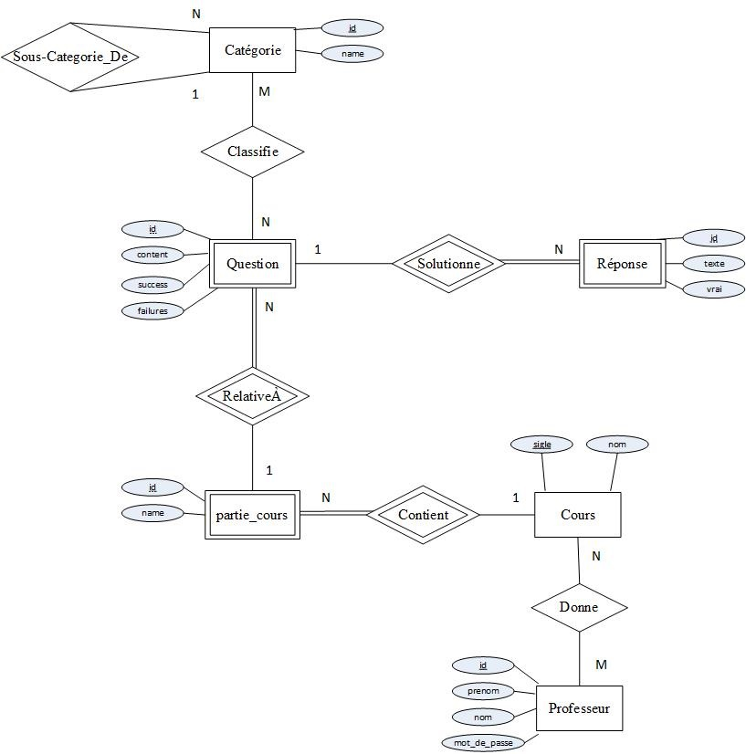

# Projet 9

Présenté par Mathieu Morin, Patrice Dumontier-Houle, Guillaume Riou et Nicolas Hurtubise

## Introduction

Le projet que nous avons mené a terme consiste en un système de questions à choix multiples, pouvant être adapté à élèves de tous les niveaux. Notre projet vise à rassembler des connaissances pertinentes à la réeussite d'un cours afin que les étudiants puissent tester leurs connaissances de manière efficace et interactive.

Notre système est conçu pour accumuler de l'information à propos des réponses des étudiants aux questions de manière à ce qu'un professeur puisse cibler la matière moins comprise. En utilisant cet outil, les professeurs pourront structurer leurs cours en fonctions des difficultés des élèves de manière à passer moins de temps à réviser les concepts les mieux assimilés, et plus de temps à focuser sur les sujets que les élèves saisissent le moins.

## Modèle Entité Relation



Le Modèle Entité Relation de notre projet comporte l'entité *professeur*, qui est identifiée uniquement par son id. Ses propriétés sont son prénom, son nom et son mot de passe. Un professeur peut donner 0 ou plusieurs cours et a accès à une section spéciale du site en se logguant avec ses identifiants.

Une entité *cours* est représentée par son sigle (par exemple `IFT2935`) et a comme attribut un nom de cours.

Chaque cours est subdivisé en parties de cours (entité *partie_cours*), qui sont identifiées par leur id et qui ont comme informations le nom de la partie (name).

Chaque entité *question* est associée à une partie de cours. Une question a un id comme identifiant et a contient son énnoncé (content), le nombre de fois qu'une personne a répondu correctement à la question (success) et le nombre de fois qu'une personne a répondu incorrectement à la question (failures). Ces nombres sont particulièrement utiles pour les professeurs désirant faire des statistiques sur les sujets les mieux compris et les plus difficilement compris par les élèves.

Les entités *réponse* consistent en des choix de réponse offerts à une question donnée et sont identifiées par un id.
Chaque réponse contient l'énoncé de réponse (texte), ainsi qu'une valeur de vérité indiquant s'il s'agit d'une réponse valide ou non (0 pour faux, 1 pour vrai).

De plus, chaque question est classifiée par sa catégorie, qui est identifiée par son id, et qui a comme information son nom (name).

Les catégories sont liées à elles-mêmes via une relation N vers 1, permettant ainsi une hiérarchie de catégories et de sous-catégories. Par exemple, on pourra avoir la catégorie "Normalisation des bases de données", qui contiendra le sujet plus spécifique "Formes normales", lui-même composé des sous-sous-catégories "1FN", "2FN", "3FN", etc.

## Modèle Relationnel


Le modèle relationel de notre projet est calqué sur notre Modèle Entité Relation, mais est beaucoup plus proche du modèle utilisé par notre application.

D'un point de vue du SQL, nos définissions de relations sont les suivantes :

```
-- Professeurs
CREATE TABLE professeurs(
    id number(10) NOT NULL,
    prenom char(30),
    nom char(30),
    mot_de_passe char(30),
    PRIMARY KEY(id)
);

-- Cours
CREATE TABLE cours(
    sigle char(7) NOT NULL,
    name varchar(127) NOT NULL,
    PRIMARY KEY(sigle)
);

-- Cours donnés par un professeur
CREATE TABLE professeur_cours(
    professeur_id number(10) NOT NULL,
    cours_id char(7) NOT NULL,
    FOREIGN KEY(professeur_id) REFERENCES professeurs(id),
    FOREIGN KEY(cours_id) REFERENCES cours(sigle),
    PRIMARY KEY (professeur_id, cours_id)
);

-- Partie de cours = Chapitre/section dans un cours
CREATE TABLE partie_cours(
    id number(10) NOT NULL,
    name varchar(127),
    cours_id char(7) NOT NULL,
    FOREIGN KEY(cours_id) REFERENCES cours(sigle),
    PRIMARY KEY(id)
);

-- Questions à choix multiples
CREATE TABLE questions(
    id number(10) NOT NULL,
    content varchar(127) NOT NULL,
    partie_cours_id number(10) NOT NULL,
    success number(10) DEFAULT 0 NOT NULL,
    failures number(10) DEFAULT 0 NOT NULL,
    FOREIGN KEY(partie_cours_id) REFERENCES partie_cours(id),
    PRIMARY KEY(id)
);

-- Réponses des questions
CREATE TABLE reponses(
    id number(10) NOT NULL,
    texte varchar(127),
    question_id number(10) NOT NULL,
    vrai number(1) NOT NULL,
    FOREIGN KEY(question_id) REFERENCES questions(id),
    PRIMARY KEY(id)
);

-- Une catégorie peut avoir des sous-catégories de façon récursive
CREATE TABLE categories(
    id number(10) NOT NULL,
    name varchar(127),
    category_id number(10) DEFAULT NULL,
    FOREIGN KEY(category_id) REFERENCES categories(id),
    PRIMARY KEY(id)
);

-- Associations entre catégories et questions
CREATE TABLE question_categories(
    question_id number(10) NOT NULL,
    category_id number(10) NOT NULL,
    FOREIGN KEY(question_id) REFERENCES questions(id),
    FOREIGN KEY(category_id) REFERENCES categories(id),
    PRIMARY KEY (question_id, category_id)
);
```

## L'Application

L'application est divisée en sections suivant les fonctionnalités suivantes :

1. Réponse à des questions aléatoires (qui peuvent être tirées au sort parmi les catégories, les cours, les parties de cours, etc.)
2. Recherche de questions et de concepts dans la base de données
3. Visualisation de statistiques générales
4. Visualisation de statistiques propres à chaque cours (page protégée en accès, restreinte aux professeurs concernés)

### 1. Réponse à des questions aléatoires

La principale fonctionnalité de l'application est de permettre aux élèves de tirer au sort des questions relatives à des concepts vus en cours pour valider leur compréhension partielle ou totale. Les élèves peuvent donc choisir de répondre aléatoirement :

1. À des questions relatives à une partie de cours
2. À des questions tirées de l'intégrité d'un cours
3. À des questions spécifiquement reliées à un des concept de la matière

[Sélection d'un type de questions aléatoires : partie de cours, intégrité d'un cours ou catégories et concepts](q0.png)

Lorsque le choix est fait, l'élève se voit présenté une question et des choix de réponse. Il peut alors sélectionner le choix qui lui semble juste et confirmer sa réponse. L'application affiche alors si la question a été réussie (en vert) ou échouée (en rouge), note le score dans le navigateur web de l'élève pour futures références et permet de passer à une autre question dans le même thème.


### 2. Recherche de questions et de concepts dans la base de données

En plus de choisir des concepts via une liste de cours et de catégories, il semblait intéressant d'ajouter la possibilité de rechercher dans la base de données en vue de trouver plus facilement des sujets spécifiques.


On peut donc rechercher un ou plusieurs termes parmi les énoncés de questions, les catégories, les cours et les parties de cours. L'option de rafiner la recherche selon les mots-clés permet de rechercher parmi les éléments contenant *l'un des mots-clés entrés* (via un `OR` SQL), ou encore parmi les éléments contenant *tous les mots-clés entrés* (via un `AND` SQL).


### 3. Visualisation de statistiques générales

La section *Stats*, accessible depuis le menu du haut, permet de donner une vue d'ensemble de la base de données, nottement en ce qui a trait aux cours et aux professeurs utilisant le système, ainsi qu'à des statistiques personnalisées.

Grâce à cette section, les élèves pourront visualiser leur taux de succès et adapter leurs efforts en conséquent.


### 4. Visualisation de statistiques propres à chaque cours

La section *Professeurs* permet de visualiser des statistiques propres à chaque cours et est réservée aux professeurs authentifiés.

Les professeurs souhaitant avoir une idée de l'état de l'apprentissage de leurs élèves devront donc se logguer dans le système en indiquant leur Prénom, Nom et Mot de passe secret.


Une fois authentifiés, les professeurs verront dans l'ordre :

1. Le taux de réussite global pour toutes leurs questions
2. Le taux de réussite pour chacune de leurs questions

Les questions sont ordonnées par cours ainsi que par taux de réussite. Il est ainsi facile de cibler rapidement quels concepts sont bien assimilés et quels concepts donnent du fils à retordre aux élèves.


## Données utilisées

Les données réalistes utilisées pour des fins de test sont insérées dans la base de données de la façon suivante :

```

```

## Requêtes de l'application


## Conclusion

Durant ce projet, nous avons découvert la facilité avec laquelle python peut permettre de développer des applications webs mais nous avons surtout pu constater le défi que représente la gestion d'une base de donnée dans une application non triviale. En effet, dans de tels entreprises, la base de donnée joue un rôle central tant dans la conservation des données que dans l'accès à celles-ci.

Nous avons choisis d'utiliser SQLite pour ce projet puisque la légéreté et la facilité d'installation de ce système nous a rendu la tâche considérablement plus facile et rapide. Les différences syntaxiques entre le SQL accepté par les systèmes Oracle et celui accepté par SQLite ne nous ont pas posés de problèmes majeurs puisque l'apprentissage de l'algèbre relationelle nous a pourvu d'un cadre théorique solide et invariant sur lequel nous pouvons nous baser dans toutes situations.

Notre projet est ainsi complet et serait utilisable par les professeurs souhaitant aider leurs élèves via un système web interactif. Il y a cependant toujours place à l'amélioration, certaines fonctionnalités telles que des statistiques de bonne réponses par étudiant pour permettre un profilage plus précis des difficultés particulières des utilisateurs du système.
